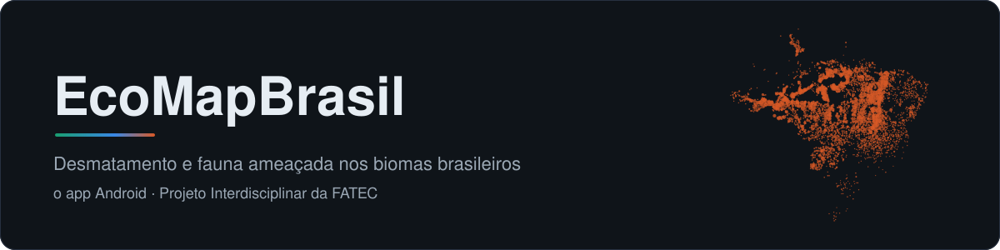
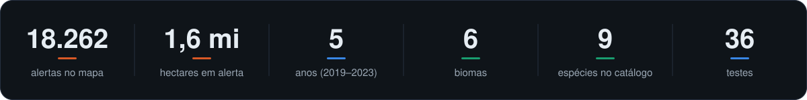
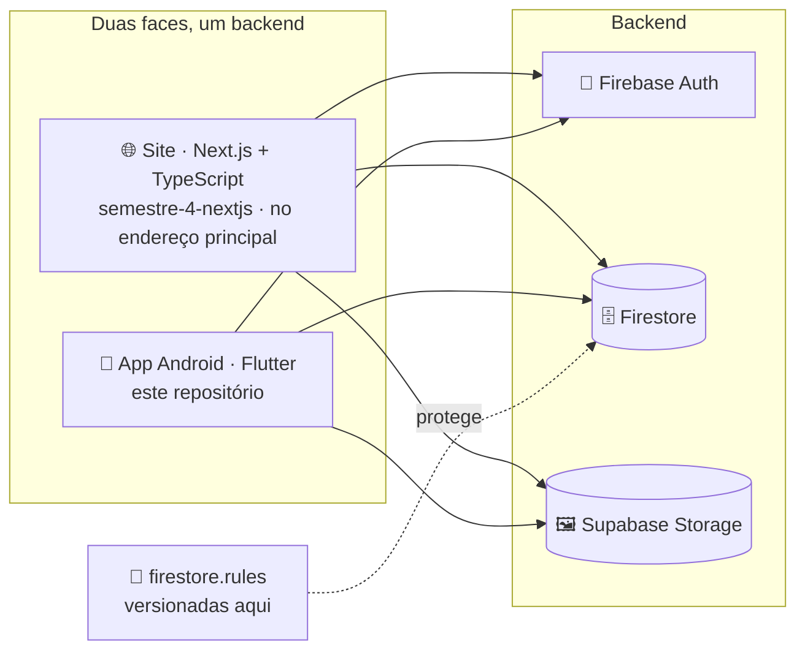

<p align="center">
  
</p>

<p align="center">
  
  
  
  
  
  
</p>

O **EcoMapBrasil** reúne num lugar só o que costuma estar espalhado em relatório e
planilha: **onde** o desmatamento acontece, **quais espécies** estão ameaçadas e o que dá
para fazer a respeito. É o Projeto Interdisciplinar de um grupo de cinco da FATEC, e
este repositório é **o app Android**, em Flutter.

O projeto tem duas faces sobre o mesmo backend: o **app**, daqui, e o **site**, que volta
a ser React, agora em Next.js, no
[semestre-4-nextjs](https://github.com/ecomap-devs/semestre-4-nextjs). Uma avaliação feita no celular
aparece no site, e vice-versa.

<p align="center">
  
</p>

## 📱 O app

| Tela | O que tem |
|---|---|
| 🏠 **Início** | Estatísticas do desmatamento, **quatro gráficos** desenhados no canvas (barras, rosca, linha e radar), linha do tempo de duas décadas, soluções práticas e as avaliações da comunidade |
| 🗺️ **Mapa** | Imagens de satélite com os **6 biomas** e a camada de **alertas do DETER-B**. Tocar num bioma abre a ficha: área, percentual desmatado e descrição |
| 🐆 **Animais** | Catálogo de **9 espécies** com busca, filtros por bioma e status de conservação, tendência populacional e as principais ameaças |
| 👤 **Conta** | Cadastro e login por e-mail e senha, foto de perfil e **avaliações em estrelas**, salvas e lidas em tempo real |

O layout se adapta à largura: `NavigationBar` no celular, `NavigationRail` em tela
larga (tablet), e grades que recalculam as colunas conforme o espaço.

## 🧭 Onde este repositório entra



**Decidido em 30/09/2026:** o site volta a ser React, em **Next.js com TypeScript**,
hospedado no **Firebase Hosting** como site estático, e fica com o endereço principal
(`ecomapbrasil-17756.web.app`), porque para site é a tecnologia mais adequada. O
Flutter fica com o que faz melhor: **o app Android**.

> [!NOTE]
> **A troca foi feita em 01/10/2026.** O endereço principal serve o site em Next.js, e
> este repositório não publica mais nada no Hosting: saíram o deploy, o preview por PR,
> o build web da CI e o check `Build web` da proteção da `main`. O código web do Flutter
> continua compilando (`flutter run -d chrome` serve para testar), só não é publicado.

**As regras do Firestore moram aqui e valem para os dois.** O banco é um só, então as
regras são uma só: duas cópias, uma em cada repositório, acabariam divergindo.

## 🛠️ Stack

| Camada | Escolha | Por quê |
|---|---|---|
| **App** | Flutter 3.47 · Dart 3.13 · Material 3 | Um código para Android, com o visual portado do React |
| **Mapa** | `flutter_map` + `latlong2` | O irmão do Leaflet usado no React, com os mesmos tiles de satélite |
| **Gráficos** | `CustomPainter` puro | Sem biblioteca de gráficos, como o SVG escrito à mão do original |
| **Conta e dados** | `firebase_auth` · `cloud_firestore` | Login por e-mail e senha e avaliações em tempo real |
| **Imagens** | `supabase_flutter` | Fotos das espécies e dos avatares |

## 🚀 Como rodar

> Pré-requisitos: Flutter 3.47+ e o Android SDK (emulador ou celular com depuração USB).

```bash
git clone https://github.com/ecomap-devs/semestre-4-flutter.git
cd semestre-4-flutter
flutter pub get

cp env.example.json env.json      # e preencha os valores
flutter run --dart-define-from-file=env.json
```

> [!IMPORTANT]
> O `--dart-define-from-file` **não é opcional**. Sem ele o app abre numa tela listando
> exatamente quais variáveis faltam, em vez de subir e quebrar lá na frente, no login.

<details>
<summary>Build, testes e o que rodar antes de abrir PR</summary>

```bash
flutter build apk --release --dart-define-from-file=env.json

dart format lib test     # o mesmo que a CI confere
flutter analyze          # tem que dar "No issues found!"
flutter test             # 36 testes
```

Use `dart format lib test`, e não `dart format .`: depois de um build Android, o `.`
entra em `build/` e tropeça em caminho longo no Windows.

</details>

## 🔑 Credenciais e segurança

O `env.json` fica fora do git, e o `env.example.json` mostra os nomes das variáveis.
Também ficam de fora, de propósito, os arquivos que as ferramentas geram **com as
chaves dentro**:

```
lib/firebase_options.dart              # o flutterfire configure gera com as chaves
android/app/google-services.json       # idem
android/key.properties                 # senha do keystore de release
android/keystore/release.jks           # o keystore de release
```

> [!WARNING]
> **Chave pública de cliente não é segredo.** A `apiKey` do Firebase e a *publishable
> key* do Supabase vão dentro do APK de qualquer jeito, e APK se descompila. Quem protege
> o dado são as **Firestore Rules** e o **RLS do Supabase**.

<details>
<summary>Uma chave do Firebase por plataforma, e os keystores</summary>

A restrição de aplicativo do Google Cloud é **exclusiva**: uma chave travada por
referenciador HTTP recusa requisição sem `Referer`, que é o caso de todo app nativo. Por
isso web e Android têm chaves diferentes.

| Variável | Restrição |
|---|---|
| `FIREBASE_API_KEY_WEB` | Referenciador HTTP (`*.web.app`, `*.firebaseapp.com`, `localhost`) + 4 APIs |
| `FIREBASE_API_KEY_ANDROID` | Package + SHA-1 dos certificados de debug **e** de release + 4 APIs |

`Env` escolhe a chave pela plataforma, e o ramo que não vale é eliminado no build.

- **Keystore de debug** compartilhado e versionado em `android/keystore/debug.jks`, para
  que os cinco assinem com o mesmo certificado e o SHA-1 cadastrado sirva para todos.
- **Keystore de release** fora do repositório. Perdê-lo significa nunca mais atualizar um
  app já instalado; e se ele for regerado, **o SHA-1 novo precisa entrar na chave
  Android**, ou o login para de funcionar no APK assinado.

As `anon` keys do Supabase foram **desativadas** em 08/09/2026, e o projeto usa a
`sb_publishable_...`.

</details>

<details>
<summary>As regras do Firestore</summary>

Versionadas em [`firestore.rules`](firestore.rules) e publicadas com
`firebase deploy --only firestore:rules`. Mudou como o app (ou o site) lê ou grava um
dado? A regra correspondente muda no mesmo PR.

- `avaliacoes`: leitura pública; escrita só logado, em nome de si mesmo, com nota de 1
  a 5 validada no `create`.
- `usuarios/{uid}`: só o dono lê. **O e-mail não é gravado ali** desde 09/09/2026: ele já
  vive no Firebase Auth, e nada no app lê essa coleção.
- Qualquer outra coleção nasce fechada.

</details>

## 🔄 CI e deploy

Tudo automático, em [`.github/workflows/`](.github/workflows/):

| Quando | O que roda |
|---|---|
| **Push ou PR** | `dart format` · `flutter analyze` · `flutter test` · build APK |

O **APK debug** fica anexado à execução da CI por 14 dias: dá para baixar e instalar no
celular sem ter Flutter montado. Os secrets viram `env.json` dentro da CI e **nunca**
entram no repositório.

A `main` é protegida: PR obrigatório, **1 aprovação** e os checks `Análise e testes` e
`Build APK` passando.

## 📁 Estrutura

<details>
<summary>As pastas de <code>lib/</code> e <code>assets/</code></summary>

```
lib/
├── config/env.dart            credenciais via --dart-define, com checagem
├── data/                      dados de referência portados do React
│   ├── animais_data.dart        catálogo de espécies
│   ├── biomas_data.dart         polígonos simplificados dos 6 biomas
│   └── home_data.dart           estatísticas, soluções, linha do tempo
├── models/                    Animal · Bioma · AlertaDesmatamento · Avaliacao
├── services/                  Firebase · avaliações · leitura do GeoJSON
├── screens/                   app_shell · home · mapa · animais
├── theme/app_theme.dart       paleta e breakpoints herdados do React
└── widgets/
    ├── charts/                  barras · rosca · linha · radar
    ├── superficie_vidro.dart    cartão de vidro, com desfoque limitado a ele
    ├── animacao_na_tela.dart    revela ao entrar na tela, sem timer
    └── auth_modal.dart · reviews_section.dart · estrelas.dart · …

assets/
├── data/alertas-desmatamento.json   GeoJSON do DETER-B/INPE
└── img/logo.png
```

</details>

## 📊 Sobre os dados

A camada de alertas usa dados públicos de detecção do **DETER-B (INPE)**: bioma, estado,
município, área em hectares e data de cada polígono. O arquivo tem 6,7 MB, mas ocupa
1,48 MB dentro do APK, que é compactado.

Os demais números (percentuais por bioma, séries populacionais das espécies e a linha do
tempo) são **valores de referência** herdados da versão React. Trocá-los por fonte
oficial (PRODES/INPE, ICMBio, IBGE, MapBiomas) é a próxima etapa.

## 🤝 Contribuindo

As regras do repositório estão no **[AGENTS.md](AGENTS.md)**: convenções de código,
padrão de commit, o que roda na CI e o que nunca pode ser commitado. Valem para os cinco
do grupo e para qualquer assistente de IA.

Em resumo: branch a partir da `main` (`feat/`, `fix/`, `docs/`), formato, análise e
testes verdes, e a revisão de alguém do grupo para mergear.

## 🎨 As artes deste README

O banner e os números são gerados do próprio repositório, sem dependência nenhuma:

```bash
node .github/arte/gerar.mjs
```

O banner desenha os 18 mil alertas do GeoJSON no lugar onde cada um foi detectado, e o
cartão conta espécies, biomas e testes **nos arquivos**, sem número digitado à mão. O
gerador é determinístico: com o repositório igual, as artes saem byte a byte iguais, e
as animações respeitam `prefers-reduced-motion`.

## 👥 Equipe

**Vinicius** · **Bruno** · **Cesar** · **João Flávio** · **João Gabriel**

A versão React do semestre anterior está em
[JoaoAlane/EcoMapBrasil](https://github.com/JoaoAlane/EcoMapBrasil).

## 📄 Licença

[MIT](LICENSE). Projeto acadêmico, sem fins lucrativos.
